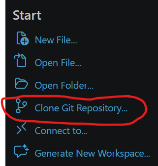
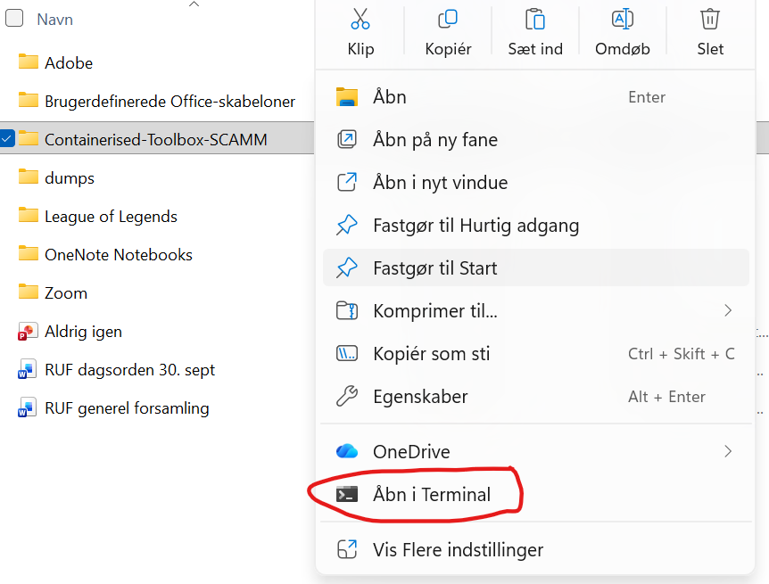
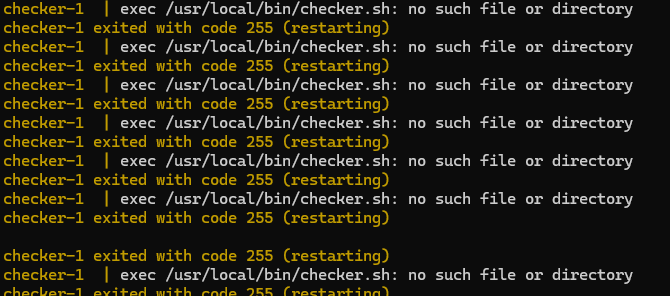
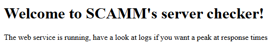

# Containerised Checker
## *Our goal with this assignment was to build a small docker compose shell script within a container. We decided to build a checker that meassures the ser http status and response time, as well as loggin server status and date at set intervals*

**Requirements:**
To run this you need:
    1. Docker desktop installed
    2. Vs Code
    3. A terminal

**Set-up:**
    1. Copy the URL to the github repository, go to VS Code and click Clone git repository

    2. Double check that you have "Container Tools" as a part of your extensions in VS Code, if you're new to VS Code it doesnt auto install the extension for everyone.

    3. Go to your pathfinder and find the project folder. Right click on it and click "Open in terminal"

    We do this to tell your terminal which files it should work with. If you you open your terminal and run the command you'll end with an error

    4. When your terminal is open, you write the command: docker compose up --build

    It'l take a few seconds but with this you should be able to go to your docker desktop and run the container. If you get this error:

            How to fix it:
            1. Go to VS Code and open checker.sh
            2. Look for CRLF in the bottom right corner and change it to LF
            3. Look for UTF-8 in the bottom right corner and change it to "Save with encoding" UTF-8 and remember to save after
            4. Go back to the terminal and rerun the command
    
    5. You can now see server and response time in your terminal, and if you go have a look at your docker desktop you should be able to see the new container running. 

    6. To see the "website" open a tab in your browser of choice and type in: localhost:8080
    and this is what should appear on your screen:
    
